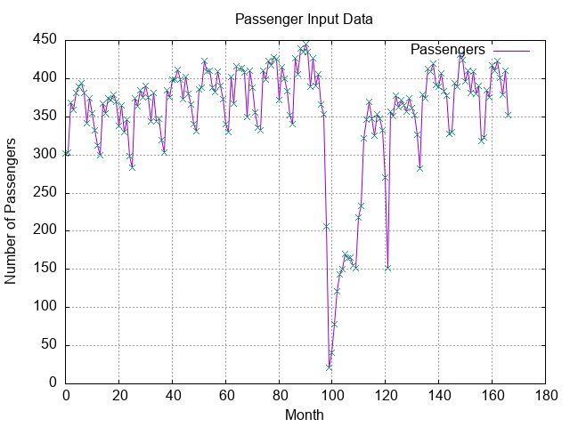
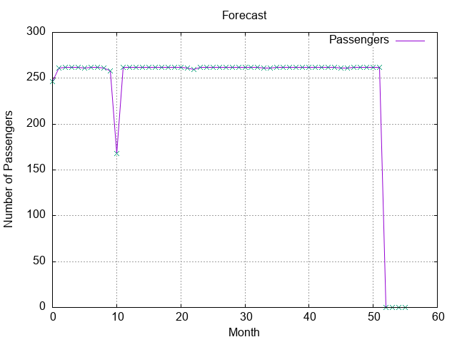

# LTSM Forecasting using LibTorch
## Overview
The [Atlanta Hartsfield-Jackson Airport](https://en.wikipedia.org/wiki/Hartsfield%E2%80%93Jackson_Atlanta_International_Airport). is one
of the busiest (if not the busiest) airport in the world typically handling over one
hundred million passengers annually.  This exercise looks at the time series trends with
passenger departure traffic at the airport.

Hartsfield-Jackson Atlanta International Airport (ATL) handled over 108 million passengers in 2024,
second only to its 2019 record, with strong domestic (86.5%) and growing international traffic.
It averages 286,000 passengers daily and 2,100 daily flights, serves as Delta's main hub, and offers
flights within a two-hour reach of 80% of the U.S. population.

## Traffic Data
The following is a graph of traffic from January 2012 until December 2025.

There is a [stationary pattern](https://en.wikipedia.org/wiki/Stationary_process) with
the data except during the [Covid-19 pandemic](https://en.wikipedia.org/wiki/Impact_of_the_COVID-19_pandemic_on_commercial_air_transport)
but nevertheless, the pattern continues.

## Forecast
The following is a forecast using the training data.

### Learning Rate 0.001

### Learning Rate 0.05

## References
<a id="1">[1]</a> Atlanta Hartsfield-Jackson Airport https://en.wikipedia.org/wiki/Hartsfield%E2%80%93Jackson_Atlanta_International_Airport  
<a id="1">[2]</a> LibTorch.
https://docs.pytorch.org/tutorials/advanced/cpp_frontend.html  
<a id="1">[3]</a>
A stable limited LibTorch. https://www.youtube.com/watch?v=HNdEmnvMvGE  
<a id="1">[4]</a>
Plotting data with c++. See book reference using this [link](https://www.oreilly.com/library/view/hands-on-machine-learning/9781789955330/2685f7fa-8d76-4b26-bd6c-53b9e2bae133.xhtml). Code repository: https://github.com/Kolkir/plotcpp/blob/master/plot.h 
<a id="1">[5]</a>
Impact of the COVID-19 pandemic on commercial air transport. https://en.wikipedia.org/wiki/Impact_of_the_COVID-19_pandemic_on_commercial_air_transport

